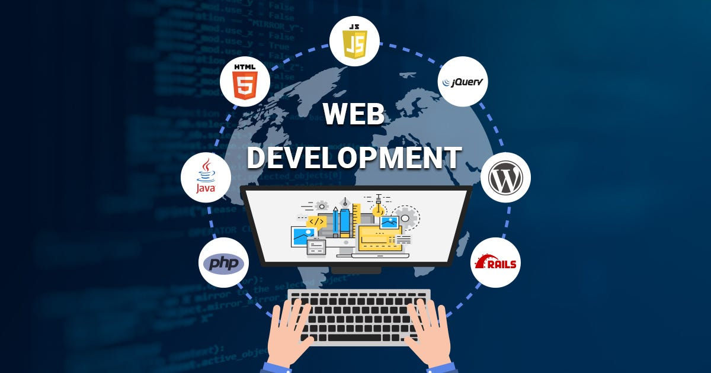

# Lessons from ICS 314 That Go Beyond the Browser

Before ICS 314, I thought software engineering mostly meant building apps and writing code that works. I now realize it’s way more than that. Web development was just the surface—we were really learning how to build software like professionals do in the real world.

In this reflection, I want to focus on three important lessons from ICS 314 that I believe apply far beyond web application development: **Agile Project Management**, **Design Patterns**, and **Coding Standards**. These concepts have changed the way I think about teamwork, maintainability, and long-term planning—no matter what kind of software project I’m working on.

---

## Agile Project Management: Structure with Flexibility

Agile Project Management is a style of managing software projects that focuses on flexibility, collaboration, and delivering working features in short time frames. Instead of trying to plan everything at once (like in traditional “waterfall” methods), Agile breaks projects into smaller chunks called **iterations** or **sprints**.

In ICS 314, we used a flavor of Agile called **Issue Driven Project Management**. In this system, each team member worked on specific “issues” tracked through GitHub Projects. Each issue represented a single, well-defined task with clear goals and deadlines.

What I liked about this method is how it kept our team on track. No one was overwhelmed by huge to-do lists. Instead, we focused on one or two tasks at a time, which made everything feel more manageable. I could definitely see myself using this same system for other kinds of group projects—like robotics, game design, or even organizing an event. It gives structure, but still leaves room for adapting when things change.

---

## Design Patterns: Reusable Solutions for Common Problems

At first, “Design Patterns” sounded intimidating. But in reality, they’re just templates for solving problems in software design. Instead of reinventing the wheel every time you write code, you use proven patterns that have worked in many other situations.

For example, we learned about the **Observer Pattern**, which is great for situations where one part of a system needs to react when something else changes—like updating a UI when a user submits a form. Another common one is the **Singleton Pattern**, which ensures only one instance of a class exists at a time.

Even though we mostly used patterns in the context of React and Next.js, I now see how these ideas apply anywhere. If I’m building a game, a sensor network, or even a backend system for a mobile app, design patterns will help me write cleaner, more maintainable code. They make collaboration easier because teammates can recognize the pattern and understand your logic faster.

---

## Coding Standards: The Unsung Hero of Team Projects

Before this course, I didn’t think much about code formatting or naming conventions. I just wrote code that worked. But ICS 314 made it clear how important **coding standards** are—especially when working in teams.

Coding standards are basically agreed-upon rules for how code should be written. They cover things like indentation, naming variables, writing comments, and organizing files. We enforced these standards using tools like ESLint and Prettier in our projects. At first, it felt annoying to fix small spacing issues, but over time, I understood why it mattered.

When everyone follows the same style, the codebase becomes more readable and easier to maintain. It also reduces confusion when switching between files or working on someone else’s code. Now, even when I’m coding alone, I try to follow consistent standards—because future me (or a future teammate) will appreciate it.

---

## Conclusion: Software Engineering Is a Mindset

ICS 314 didn’t just teach me how to make websites—it taught me how to **think like a software engineer**. Agile project management taught me how to collaborate. Design patterns showed me how to build smarter systems. And coding standards made me realize that clean code is just as important as functional code.

I’ll take these lessons with me into future classes, internships, and side projects. Whether I’m building an app, a robot, or a data processing system, these core principles will always apply. And for that, I’m thankful this class went way beyond just "web dev."

---

**Used AI to help organize and put in correct format**

