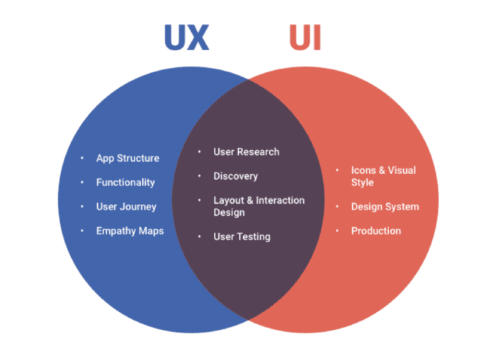

Why UI Frameworks Make Web Design So Much Easier
If you've ever tried to build a website from scratch with just HTML and CSS, you know how frustrating it can be. Everything looks different on different screen sizes, and getting things to align properly takes forever. This is where UI frameworks like Bootstrap 5 come in. Instead of writing tons of custom CSS, you can use pre-made styles and layouts to make websites look good with way less effort.

As web developer Mark Otto, co-creator of Bootstrap, once said:

"Bootstrap was born of a need for a simple, consistent, and powerful front-end framework. It helps developers focus on functionality instead of fighting CSS."

In this essay, I’ll explain why UI frameworks are worth using, my personal experience with Bootstrap 5, and why I wouldn’t go back to writing plain HTML and CSS for every project.

1. Why Not Just Use Plain HTML and CSS?
When I first started making websites, I thought using raw HTML and CSS was enough. But once I tried to make a navbar that looked good on both a phone and a laptop, things got really frustrating. I had to write custom media queries, fix padding issues, and deal with browser inconsistencies.

For example, without Bootstrap, a simple button needs custom CSS just to look decent:

html
Copy
Edit
<button class="custom-btn">Click Me</button>

Now, imagine doing this for every single button, navbar, and form on your website. That’s a lot of work.

Web design expert Ethan Marcotte, who introduced responsive web design, said:

"Instead of worrying about all the tiny CSS details, developers should focus on structuring content. UI frameworks help us get there faster."

2. Bootstrap 5 to the Rescue
Bootstrap 5 makes everything easier. Instead of writing a bunch of custom CSS, you just use pre-made classes. Here’s the same button in Bootstrap 5:

html
Copy
Edit
<button class="btn btn-primary">Click Me</button>
With just one class (btn btn-primary), Bootstrap automatically adds:

A blue background
White text
Padding and rounded corners
Hover effects
And if I want a red button instead? I just change the class:

html
Copy
Edit
<button class="btn btn-danger">Click Me</button> <!-- Red button -->
No need to write extra CSS! As Steve Krug, author of Don’t Make Me Think, puts it:

"Users don’t care how much effort you put into your site’s CSS. They just want it to work and look good."

3. My Experience Using Bootstrap 5
In ICS 314, I used Bootstrap 5 for two projects:

🌴 Island Snow – A Hawaii-based online store.
🍹 Kō Hana Rum – Our Journey page.
Before using Bootstrap, I had a hard time centering images, making text look good, and creating a responsive navbar that worked on all screen sizes. But with Bootstrap, I was able to build a clean, structured layout in minutes.

Here’s an example from the Kō Hana Rum footer I worked on:

html
Copy
Edit
<footer class="bg-black text-white py-4">
    

        
        
ALOHA@KOHANARUM.COM | (808) 649-0830

        
92-1770 Kunia Rd, Kunia, HI 96759, USA

        

            <a href="#"><i class="bi bi-instagram text-white"></i></a>
            <a href="#"><i class="bi bi-facebook text-white"></i></a>
            <a href="#"><i class="bi bi-twitter text-white"></i></a>
        

        
<a href="#" class="text-gold">TERMS & CONDITIONS</a> | <a href="#" class="text-gold">PRIVACY POLICY</a>

    

</footer>
With Bootstrap classes, I didn’t have to worry about:

Spacing (py-4)
Text color (text-white, text-gold)
Alignment (d-flex justify-content-between)
Icons (bi bi-instagram)
It all just worked.

4. When Not to Use Bootstrap
While Bootstrap is great, it’s not always necessary. If you're making a super simple site, like a basic one-page resume, plain HTML and CSS might be enough.

Also, if you want complete creative control, Bootstrap’s built-in styles might feel restrictive. In that case, frameworks like Tailwind CSS (which lets you customize everything) might be better.

As Brad Frost, creator of Atomic Design, says:

"Bootstrap is great for speed, but sometimes you need to go beyond pre-built styles to make your website feel unique."

Conclusion: Is Bootstrap Worth It?
After using Bootstrap 5, I wouldn’t go back to styling everything from scratch. It makes web development faster, easier, and more consistent. Instead of spending hours fixing alignment and spacing, I can focus on actually building the website.

If you're new to web development and want to make professional-looking websites without all the extra work, Bootstrap 5 is the way to go. 

As Jeffrey Zeldman, web standards pioneer, puts it:

"Good design is about making other designers jealous. UI frameworks like Bootstrap help you get there faster."

I used ChatGPT to help me organize my essay better and give me a basic layout.

### References

- Otto, Mark. Bootstrap: A Framework for the Web. 2011.
- Marcotte, Ethan. Responsive Web Design. 2010.
- Krug, Steve. Don’t Make Me Think. 2000.
- Frost, Brad. Atomic Design. 2016.
- Zeldman, Jeffrey. Designing with Web Standards. 2003.
