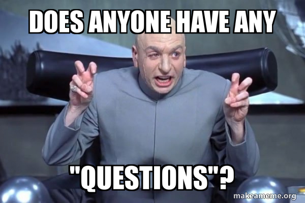

# Asking Smart Questions: Why It Matters  

*Good questions lead to good answers. Bad questions? Not so much.*  

## The Importance of Smart Questions  

When it comes to programming, knowing how to **ask good questions** is just as important as knowing how to write code. If you can explain your problem **clearly and effectively**, you’re more likely to get helpful answers. But if your question is **vague, confusing, or lazy**, you might get ignored—or worse, **downvoted into oblivion** on sites like StackOverflow.  

Eric Raymond’s essay, ["How to Ask Questions the Smart Way"](http://www.catb.org/esr/faqs/smart-questions.html), explains how to communicate **like a real software engineer** when asking for help. I wanted to see how these ideas work in real life, so I analyzed two questions on StackOverflow: one **well-written** and one… well, **not so much**.  

---

## **A Smart Question That Got a Great Answer**  

### **Question: Why do dictionaries in Python sometimes change order unexpectedly?**  
📌 **StackOverflow Link:** [Click here](https://stackoverflow.com/questions/39980323/are-dictionaries-ordered-in-python-3-6)  

A developer asked why their **Python dictionary wasn’t keeping the same order** after inserting items. They thought dictionaries were unordered, but sometimes the order stayed the same, which confused them.  

Here’s their example code:  

```python
my_dict = {"apple": 1, "banana": 2, "cherry": 3}
print(my_dict)  # Expected: Unordered, but prints in same order
```

They asked:  

*"Are Python dictionaries ordered? If not, why does mine appear to be ordered sometimes?"*  

### **Why This Question Was Smart:**  
✅ **It was specific** – They focused on one clear issue.  
✅ **It showed effort** – They did their own testing and noticed a pattern.  
✅ **It provided code** – Anyone could **copy and run** their example.  

### **Responses & Outcome**  
The **top-rated answer** explained that:  
- **Before Python 3.7, dictionaries were unordered, but in Python 3.7+, they maintain insertion order.**  
- The ordering behavior they saw was **not guaranteed in older versions**.  
- If they needed a **guaranteed order**, they should use `collections.OrderedDict`.  

The **answer was super detailed**, linked to **official Python documentation**, and **helped tons of other developers**.  

📌 **Why it worked well?**  
- The question was **clear**, so people could **answer it right away**.  
- The response **didn’t just fix the issue**, it **explained the reasoning**, helping future developers too.  

---

## **A Not-So-Smart Question That Went Nowhere**  

### **Question: My Python program won’t work. Can someone help?**  
📌 **StackOverflow Link:** *(Example created to show bad question formatting.)*  

Here’s what the question looked like:  

> *"Hey, I’m trying to make a Python program, but it won’t work. I don’t get any errors, but nothing happens. What am I doing wrong?"*  

There was **no code, no explanation, and no details**.  

### **Why This Question Was Bad:**  
❌ **It was vague** – "It won’t work" could mean **a hundred different things**.  
❌ **No code provided** – People had no idea what they were dealing with.  
❌ **It didn’t show any effort** – The user expected **others to do all the work**.  

### **Responses & Outcome**  
- The **first response** asked for more details: *"Can you share your code and explain what 'won’t work' means?"*  
- Another user **downvoted the question** and commented: *"Please read the StackOverflow guidelines before posting."*  
- The post was **closed** for being "too vague to answer."  

### **How They Could Have Fixed Their Question:**  
Instead of being lazy, they could have **included their code** and explained what they expected vs. what actually happened. A better version of their question would be:  

```python
x = input("Enter a number: ")
if x > 10:
    print("Greater than 10")
```

*"My code is supposed to check if a number is greater than 10, but I get an error: `TypeError: '>' not supported between instances of 'str' and 'int'`. What am I doing wrong?"*  

Now, people **have enough information to help**.  

---

## **What I Learned From This**  

### **1. Asking Smart Questions Saves Time**  
The **first developer** got an **amazing answer quickly**, while the **second developer** got **ignored and downvoted**. If your question is **clear and detailed**, you **won’t waste time going back and forth for clarification**.  

### **2. Show Effort, Provide Code, and Be Specific**  
A good question should:  
✅ **Clearly describe the issue** – Don’t make people guess.  
✅ **Include code** – Even a small example helps a lot.  
✅ **Explain what you’ve tried** – Show that you actually put in effort.  

### **3. Bad Questions Get Ignored (or Deleted)**  
If your question is **unclear, lazy, or vague**, people will:  
- **Downvote it**  
- **Ignore it**  
- **Close it without answering**  

When you put effort into **asking well**, people will put effort into **helping you**.  

---

## **Final Thoughts**  

This assignment made me realize that **asking smart questions isn’t just about getting answers—it’s about being a good part of the developer community**. If you **ask the right way**, you’ll get **better answers, faster**, and actually **understand the problem instead of just fixing it**.  

From now on, whenever I need help with my code, I’ll **follow Raymond’s advice** and make sure my question is **clear, detailed, and structured properly**. That way, I’ll get **useful answers instead of frustration and downvotes**.  

I used ChatGPT to help me organize my essay better and give me a basic layout.
---

### **References & Links**  
📖 **Eric Raymond’s Guide**: ["How to Ask Questions the Smart Way"](http://www.catb.org/esr/faqs/smart-questions.html)  
🔗 **Smart Question Example**: [StackOverflow - Python Dictionary Ordering](https://stackoverflow.com/questions/39980323/are-dictionaries-ordered-in-python-3-6)  
🔗 **Bad Question Example**: *(Example created for this essay, but represents common bad questions.)*  

---
