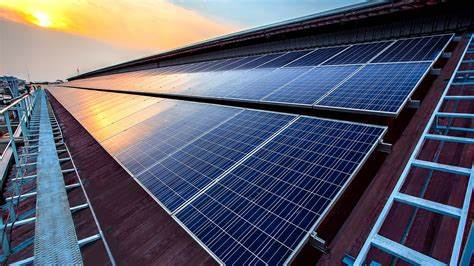

### Overview  
This project explores the feasibility of using Tesla's photovoltaic (PV) solar panels and Powerwall battery storage to fully power a 5,000-square-foot house in Waialae-Iki, Oahu. The study aims to determine the power requirements, design specifications, and cost considerations necessary for a home to rely solely on solar energy. Using Tesla’s solar estimator and research on renewable energy solutions, we calculated the estimated annual load, optimal panel configuration, and the role of battery storage in ensuring continuous energy availability. The study also examined the potential environmental impact of solar panel installation and Hawaii's tax incentives for solar energy adoption.

### My Role in the Project  
My role in this project focused on evaluating **the environmental impact, global sustainability considerations, and efficiency of the proposed system**. I researched how solar panel production and disposal affect the environment, as well as how widespread adoption of solar energy could contribute to global sustainability efforts. Additionally, I analyzed the expected efficiency of the system by considering factors like panel degradation, Hawaii’s sunlight exposure, and energy losses during conversion. I was responsible for approximately **one-third of the research and analysis**, ensuring that our study provided a well-rounded understanding of both the benefits and challenges of solar energy implementation.

### Lessons Learned  
Through this project, I gained valuable insights into **the complexities of solar energy systems and the trade-offs associated with renewable energy adoption**. I learned how to **calculate energy requirements based on real-world data** and how factors such as shading, temperature, and efficiency losses affect solar panel performance. Additionally, I developed a deeper understanding of how **energy storage solutions, like Tesla Powerwall, play a crucial role in stabilizing power supply** for residential solar systems. This experience also reinforced the importance of teamwork, as we had to **divide research responsibilities, analyze data collectively, and integrate our findings into a cohesive report**.

### Design Specifications  
The house is located in a residential area of Oahu, receiving ample sunlight with minor obstructions from nearby buildings and trees. Using Tesla’s solar calculator, the estimated annual energy consumption is **16,927 kWh**, requiring a **14.58 kW PV system** with solar panels, an inverter, and an energy gateway. Excess energy can be stored in Tesla Powerwall batteries to ensure continuous supply and reduce reliance on the grid.

### System Components  
The proposed system includes:  
- **Solar Panels**: Tesla panels, rated for temperatures between -40°F to 185°F, with dimensions of **74.4" × 41.2" × 1.57"**. These panels come with a **25-year warranty**.  
- **Inverter & Gateway**: The Tesla inverter (dimensions **26" × 16" × 6"**) converts DC from the panels into usable AC power, while the gateway monitors energy production and usage.  
- **Powerwall Battery Storage**: Each Tesla Powerwall has a **13.5 kWh capacity**, dimensions of **43.25" × 25" × 7.6"**, and a **10-year warranty**. This allows energy storage for nighttime use or backup during power outages.  

### Project Distribution  
Each team member was responsible for specific aspects of the project:  
- **Kristian**: Capacity factor, project duration, and system design.  
- **Jamie**: Permits, tax credits, project costs, and cost per kWh.  
- **Alex**: Environmental impacts, global issues, and system efficiency.  

### Example Calculation  
Using Tesla’s solar estimator, we projected:  

<pre>
Estimated Annual Load: 16,927 kWh  
Required Solar Capacity: 14.58 kW  
Powerwall Storage: ~13.5 kWh per unit  
</pre>

### Environmental Impact  
While solar energy is a sustainable solution, panel manufacturing has environmental effects, including energy-intensive production and waste disposal concerns. Additionally, large-scale solar farms may impact wildlife, such as Hawaii’s endangered bird species.

### References  
- [Tesla Solar Panels](https://www.tesla.com/solarpanels)  
- [Tesla Powerwall](https://www.tesla.com/powerwall)  
- [Solar Technology Basics](https://www.energy.gov/eere/solar/solar-photovoltaic-technology-basics)  
- [Environmental Impact of Solar Panels](https://honuaolabioenergy.com/environmental-impact-of-solar-panel-manufacturing/)  
- [How Solar Power Affects Hawaii’s Wildlife](https://spectrumlocalnews.com/hi/hawaii/environment/2022/01/07/how-solar-facilities-might-harm-hawaii-s-endangered-birds-is-outlined-in-a-new-report)  
